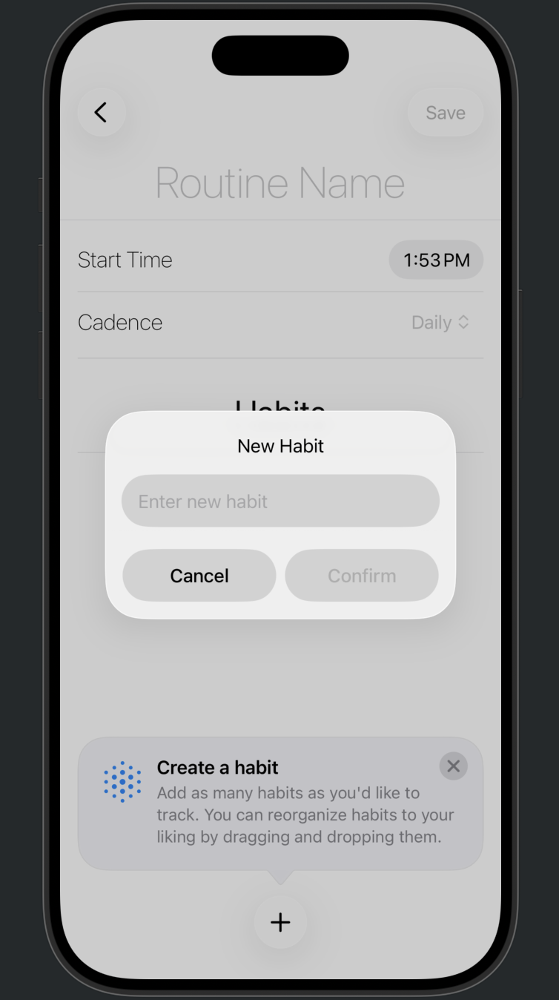

# Youtine!

Youtine! is a beautifully designed routine and habit tracking app built with SwiftUI and Swift Data. Organize your daily habits into routines, set reminders, and visualize your progress with an intuitive interface.

---

## Features
- **Create & Manage Routines:** Add, edit, and delete routines for different times of your day.
- **Flexible Habits:** Add habits to each routine for structured productivity.
- **Smart Scheduling:** Choose a cadence (daily, weekly, monthly) for each routine.
- **Reminders:** Receive notifications for routines at their scheduled times.
- **Drag & Drop:** Reorder both routines and habits for ultimate flexibility.
- **Light & Dark Mode:** Beautiful support for light and dark appearance, with a quick toggle.
- **Accessible Design:** Built with accessibility in mind for all users.

---

## Screenshots
<!--
After adding your screenshots (e.g. `screenshots/main.png`), uncomment and update the following:

*Main routines overview*

*Viewing habits in a routine*
-->

---

## Getting Started
1. Open the project in Xcode 26 or later.
2. Build and run on an iOS device or simulator.

---

## Tech Stack
- **SwiftUI**: Declarative UI framework for rapid development
- **Swift Data**: Modern persistence for app data
- **UserNotifications**: Timely and reliable reminders

---

## Contributing
Pull requests are welcome! For major changes, please open an issue first to discuss what you would like to change.

---

## License
MIT License. See [LICENSE](LICENSE) for details.

---

## Credits
Created by Bobby Guerra.

---

## Add Screenshots
To display screenshots with captions:
1. Add your screenshot images to a `screenshots/` directory at the root of your project.
2. Uncomment the screenshot section above and update file names and captions as needed.

If you provide screenshot files or file names, I can update this README for you!
